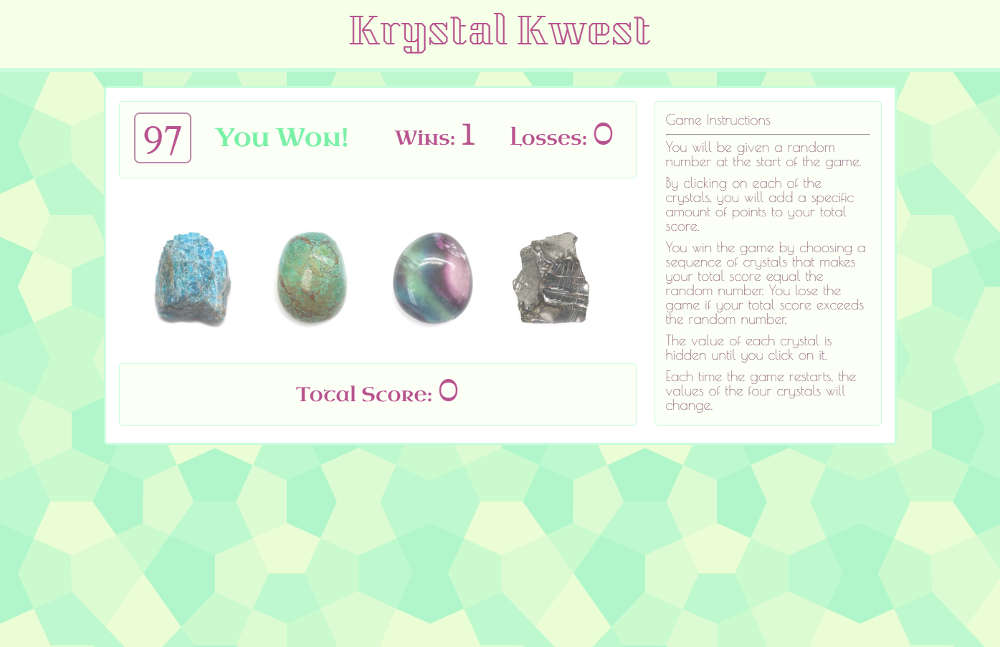

# Crystal Collector Game
## UNC Coding Bootcamp jQuery Homework #4  10-2-2018

This game is a simple "gem collector" type game where the user has to reach a target points value without exceeding it. 
The user accumulates points by clicking on one of the four images, which have points randomly assigned to them.

This app uses:
* Javascript and jQuery for game logic and interactivity
* HTML and CSS for layout and styling

My deployed app can be viewed here: https://zinc-glaze.github.io/unit-4-game/

### Screenshot

The assignment specified the following requirements:

* There will be four crystals displayed as buttons on the page.

   * The player will be shown a random number at the start of the game.

   * When the player clicks on a crystal, it will add a specific amount of points to the player's total score. 

     * Your game will hide this amount until the player clicks a crystal.
     * When they do click one, update the player's score counter.

   * The player wins if their total score matches the random number from the beginning of the game.

   * The player loses if their score goes above the random number.

   * The game restarts whenever the player wins or loses.

     * When the game begins again, the player should see a new random number. Also, all the crystals will have four new hidden values. Of course, the user's score (and score counter) will reset to zero.

   * The app should show the number of games the player wins and loses. To that end, do not refresh the page as a means to restart the game.

* The random number shown at the start of the game should be between 19 - 120.

* Each crystal should have a random hidden value between 1 - 12.

